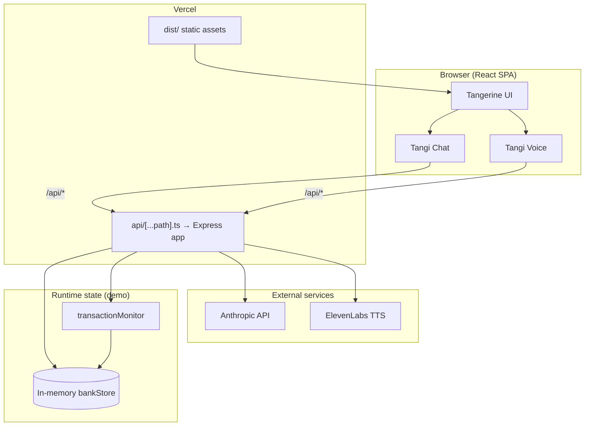

# Tangerine × Tangi

A mobile-first prototype of the Tangerine banking experience with an embedded AI financial companion (**Tangi**). Tangi monitors account activity, surfaces ranked insights before the user asks, and can execute bounded actions (e.g. internal transfers) through tool use—not a passive Q&A chatbot.

> **Positioning:** Tangerine already holds the data. Tangi is the proactive layer that interprets it, warns early, and helps users act in conversation.

---

## Table of contents

- [Architecture](#architecture)
- [Tech stack](#tech-stack)
- [Repository layout](#repository-layout)
- [Getting started](#getting-started)
- [Environment variables](#environment-variables)
- [API reference](#api-reference)
- [Tangi agent design](#tangi-agent-design)
- [Frontend](#frontend)
- [Deployment](#deployment)
- [Limitations and production path](#limitations-and-production-path)
- [Security](#security)
- [Scripts](#scripts)
- [License](#license)

---

## Architecture

The application is a **single deployable unit** on Vercel: a static Vite/React SPA plus Express routes exposed as serverless functions.



| Layer | Responsibility |
|-------|----------------|
| **React SPA** | Tangerine-style accounts UI, Tangi chat/voice surfaces, client state via `AppContext` |
| **Express (`server/app.ts`)** | REST API, transaction monitoring, agent tool execution |
| **Vercel serverless** | `api/[...path].ts` re-exports the Express app for `/api/*` |
| **Anthropic** | Tangi reasoning + multi-step tool calling |
| **ElevenLabs** | Text-to-speech for voice mode (browser STT for input) |
| **Rule engine fallback** | `src/lib/sageEngine.ts` when API is unreachable or keys are missing |

Local development runs the SPA and API as **two processes** (`vite` + `tsx`), with Vite proxying `/api` → `localhost:3001`.

---

## Tech stack

| Area | Choice |
|------|--------|
| UI | React 19, TypeScript, Tailwind CSS 4, Lucide icons |
| Build | Vite 8 |
| API | Express 5, Node ESM |
| Agent | Anthropic Messages API + tool use (`claude-haiku-4-5-20251001` by default) |
| Voice | ElevenLabs TTS + Web Speech API (Chrome) |
| Deploy | Vercel (static + serverless functions) |

---

## Repository layout

```
techto/
├── api/
│   └── [...path].ts          # Vercel entry — mounts Express app
├── server/
│   ├── app.ts                # Express routes (shared local + Vercel)
│   ├── index.ts              # Local dev server (port 3001)
│   ├── data/seed.ts          # Seed accounts, transactions, goals
│   ├── store/bankStore.ts    # In-memory ledger + agent memory
│   └── services/
│       ├── sageAgent.ts      # Claude agent + tool definitions
│       ├── transactionMonitor.ts  # Rule-based alert generation
│       └── elevenlabs.ts     # TTS client
├── src/
│   ├── components/           # UI (home, accounts, tangi chat/voice)
│   ├── context/AppContext.tsx
│   ├── lib/api.ts            # Typed fetch client
│   ├── lib/sageEngine.ts     # Offline Tangi responses
│   └── data/mockData.ts      # Client-side seed + insights
├── vercel.json
├── .env.example
├── AGENT_SETUP.md            # Agent integration deep-dive
└── DEPLOY.md                 # Vercel deployment checklist
```

Internal filenames still use `sage`/`Sora` in places; all **user-facing** copy uses **Tangi**.

---

## Getting started

### Prerequisites

- **Node.js** 20+ (LTS recommended)
- **npm** 10+
- API keys for full agent + voice (optional for UI-only exploration)

### Install

```bash
git clone <repo-url>
cd techto
npm install
cp .env.example .env
# Edit .env with your keys (see below)
```

### Run locally (recommended)

Runs frontend and API together:

```bash
npm run dev:all
```

| Service | URL |
|---------|-----|
| App | http://localhost:5173 |
| API health | http://localhost:3001/api/health |

### Run separately

```bash
npm run dev          # Vite only (uses offline Tangi + client-side transfer fallback)
npm run dev:server   # API only
```

### Production build

```bash
npm run build
npm run preview      # Preview static build (API not included)
```

---

## Environment variables

Copy `.env.example` to `.env` at the project root. **Never commit `.env`.**

| Variable | Required | Description |
|----------|----------|-------------|
| `ANTHROPIC_API_KEY` | For live Tangi | Anthropic API key |
| `ANTHROPIC_MODEL` | No | Default: `claude-haiku-4-5-20251001` |
| `ELEVENLABS_API_KEY` | For TTS | ElevenLabs API key |
| `ELEVENLABS_VOICE_ID` | No | Default: `21m00Tcm4TlvDq8ikWAM` |
| `PORT` | No | Local API port (default `3001`) |

On Vercel, set the same variables under **Project → Settings → Environment Variables** and redeploy.

---

## API reference

Base path: `/api` (proxied to port 3001 in local dev).

### `GET /api/health`

```json
{ "ok": true, "sage": true, "sora": true }
```

`sage` / `sora` indicate whether Anthropic and ElevenLabs keys are configured (legacy field names).

### `GET /api/snapshot`

Returns full financial snapshot: accounts, recent transactions, goals, active alerts, agent memory. Triggers a transaction scan before responding.

### `GET /api/alerts`

Runs `transactionMonitor` and returns ranked alerts.

### `POST /api/transfer`

```json
{ "from": "chequing", "to": "savings", "amount": 200 }
```

Response includes updated `snapshot` on success. Validates balance server-side.

### `POST /api/sage/briefing`

Proactive opening message. Uses Claude when configured; otherwise returns a deterministic briefing from monitored alerts.

### `POST /api/sage/chat`

```json
{
  "message": "Move $200 to savings",
  "history": [{ "role": "user", "content": "..." }, { "role": "assistant", "content": "..." }]
}
```

Response:

```json
{
  "reply": "...",
  "toolsUsed": ["run_transaction_scan", "transfer_money"],
  "snapshot": { ... }
}
```

### `POST /api/sora/speak`

```json
{ "text": "Brief spoken summary for the user." }
```

Returns `audio/mpeg` body (ElevenLabs). Client falls back to `speechSynthesis` if unavailable.

---

## Tangi agent design

Tangi is implemented as a **tool-augmented LLM agent**, not a single-shot prompt.

### Design principles

1. **Proactive first** — On session open, run `run_transaction_scan` and lead with the highest-urgency insight; avoid generic openers.
2. **Grounded in data** — Balances and transactions come from tools, not model hallucination.
3. **Confirm before acting** — Transfers require explicit user confirmation in conversation (voice or chat).
4. **Graceful degradation** — Missing API keys or network errors fall back to `sageEngine.ts` rules on the client.

### Tools (server)

| Tool | Purpose |
|------|---------|
| `run_transaction_scan` | Evaluate rules over last 30 days; refresh alerts |
| `get_account_snapshot` | Read balances, tx, goals, memory |
| `transfer_money` | Move funds between chequing ↔ savings |
| `dismiss_alert` | Persist resolved insight IDs in agent memory |
| `set_weekly_dining_limit` | Store soft cap in memory |

### Transaction monitor (rules)

`server/services/transactionMonitor.ts` implements deterministic checks, e.g.:

- Chequing balance vs upcoming rent → overdraft risk  
- Bill spikes (Rogers), dining overspend, savings goal drift  
- Low-utility subscriptions  

Alerts are ranked by `urgency` and filtered by `memory.resolvedInsights`.

### Voice flow

1. Tangi generates briefing text (Claude or scripted).  
2. `POST /api/sora/speak` → ElevenLabs audio playback.  
3. User speaks → Web Speech API → `POST /api/sage/chat` → spoken reply.  
4. Transfer approval path: user says “yes” or taps **Yes, move $200** → `transfer_money` via `AppContext.transferFunds`.

See [AGENT_SETUP.md](./AGENT_SETUP.md) for integration details and extension notes.

---

## Frontend

- **State:** `AppContext` holds navigation, chat history, API snapshot, and coordinates online/offline Tangi.  
- **Snapshot sync:** Polls `/api/snapshot` every 45s; account screens prefer `snapshot` over static mock data when available.  
- **Mobile framing:** `PhoneFrame` constrains layout for demo presentation; remove for full-bleed responsive if needed.  
- **Styling:** Tangerine brand orange (`#ff6600`); Tangi surfaces use `TangiIcon` / `OrangeIcon` components.

---

## Deployment

Hosted as a **Vercel** project: Vite build → `dist/`, API via `api/[...path].ts`.

```bash
npm i -g vercel
vercel login
vercel --prod
```

Configure environment variables in the Vercel dashboard, then redeploy.

Full checklist: [DEPLOY.md](./DEPLOY.md)

**Post-deploy checks:**

- `https://<app>.vercel.app/api/health` → `sage: true`, `sora: true`  
- Open app → **Tangi noticed** banner → chat → voice transfer flow  

---

## Limitations and production path

| Current (demo) | Production with Tangerine |
|----------------|---------------------------|
| In-memory `bankStore` (resets on serverless cold start) | Core banking APIs / event-sourced ledger |
| Rule-based monitor | Rules + ML anomaly detection on real transaction stream |
| Chat-initiated transfers | OAuth2 + step-up auth + bank transfer API |
| Polling for alerts | Webhooks on `transaction.created`, push (FCM/APNs) |
| Single demo user (`Jordan`) | Per-user tenancy, PII encryption, audit logs |

**Serverless note:** Long-running agent loops are capped at 60s (`vercel.json`). Prefer Haiku for latency and cost; use Sonnet only if reasoning quality demands it.

---

## Security

- API keys are **server-side only** (never `VITE_*` prefixed).  
- No authentication on API routes—acceptable for a hackathon demo; production requires session tokens, rate limiting, and CSRF protection on mutating endpoints.  
- Transfer tool should map to bank-grade authorization (2FA, limits, idempotency keys) before any real deployment.  
- Do not commit `.env` or expose Anthropic/ElevenLabs keys in client bundles.

---

## Scripts

| Command | Description |
|---------|-------------|
| `npm run dev` | Vite dev server (port 5173) |
| `npm run dev:server` | Express API with hot reload (port 3001) |
| `npm run dev:all` | Both via `concurrently` |
| `npm run build` | Typecheck + production SPA build |
| `npm run preview` | Serve `dist/` locally |
| `npm run lint` | ESLint |

---

## License

Private / hackathon use unless otherwise specified by the repository owner.

---

## Further reading

- [AGENT_SETUP.md](./AGENT_SETUP.md) — Tangi tools, voice pipeline, local troubleshooting  
- [DEPLOY.md](./DEPLOY.md) — Vercel env vars and deployment verification
